## 简介
本服务基于minio高可用对象存储开发的一套spring boot文件存储服务。数据库采用mysql，持久层框架采用mybatis plus，很多工具类使用了一个更好用的java工具库Hutool。

项目github地址：https://github.com/2434017367/minio-serve-java

---
* minio https：//www.minio.org.cn/
* MyBatis Plus：https://baomidou.com/
* Hutool：https://hutool.cn/docs/#/

## 安装
### docker安装minio
这里只对docker环境进行简单描述，其他方法不一一赘述。

---
#### 1. 搜索和下载minio镜像

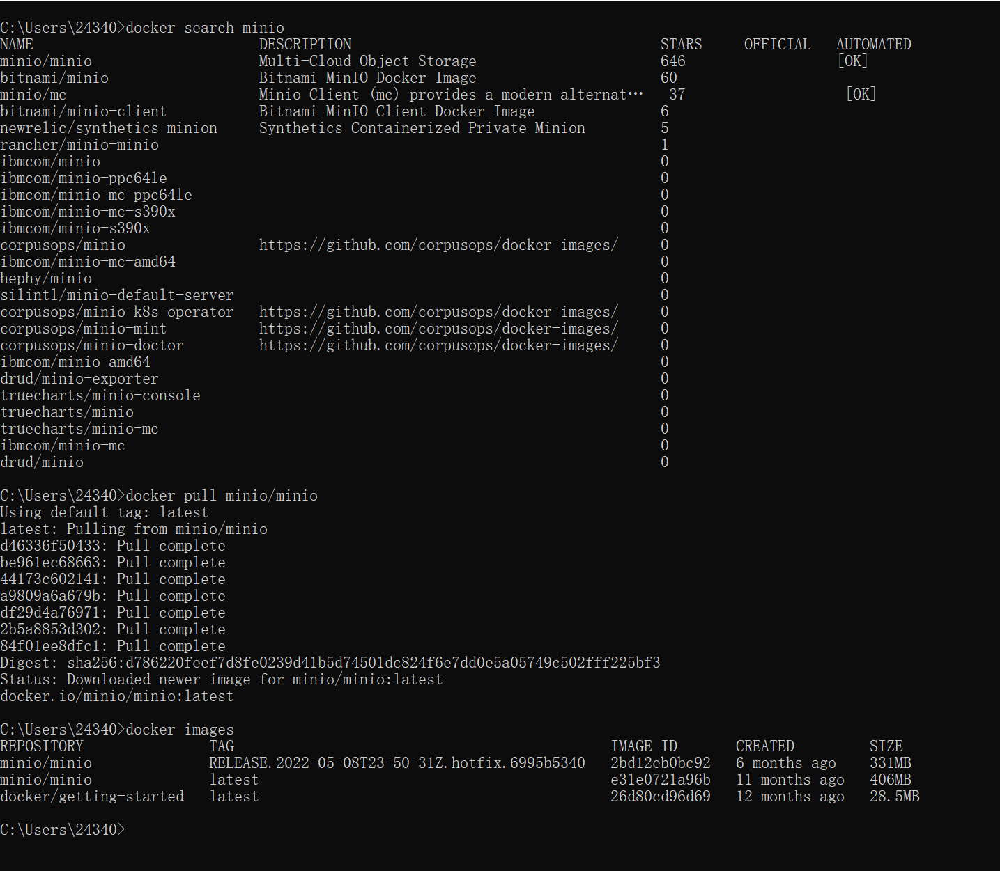
#### 2. 运行minio镜像

```docker
docker run -d -p 9000:9000 -p 9001:9001 --name minio 
-e "MINIO_ACCESS_KEY=admin" 
-e "MINIO_SECRET_KEY=admin.9532" 
-v D:\minio\data:/data 
-v D:\minio\config:/root/.minio 
minio/minio server /data --console-address ":9001"
```
> -d: 后台运行容器，并返回容器ID；
> 
> -p: 指定端口映射，格式为：主机(宿主)端口:容器端口
> 
>> 这里的9000代表minio服务运行端口，9001代表minio服务管理端服务端口。
> 
> -e: 设置镜像内自定义的环境变量；
>> 这里MINIO_ACCESS_KEY代表登录账号，MINIO_SECRET_KEY代表登录密码
> 
> -v：将镜像运行时的宿主机地址映射到主机地址
> 
> 更多docker run指令请参考https://www.runoob.com/docker/docker-run-command.html
> 
> 更多docker中minio运行请参考https://juejin.cn/post/6988340287559073799

安装完查看是否可以访问

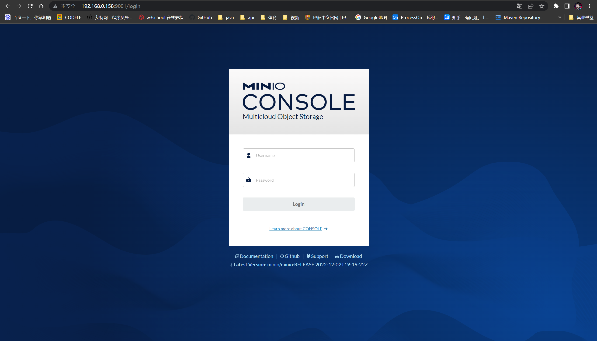

### mysql
表结构

---

```mysql
SET NAMES utf8mb4;
SET FOREIGN_KEY_CHECKS = 0;

-- ----------------------------
-- Table structure for apps
-- ----------------------------
DROP TABLE IF EXISTS `apps`;
CREATE TABLE `apps`  (
                         `id` char(32) CHARACTER SET utf8 COLLATE utf8_general_ci NOT NULL,
                         `app_key` char(32) CHARACTER SET utf8 COLLATE utf8_general_ci NOT NULL,
                         `minio_bucket` varchar(255) CHARACTER SET utf8 COLLATE utf8_general_ci NOT NULL COMMENT 'minio中所在数据桶',
                         PRIMARY KEY (`id`) USING BTREE,
                         UNIQUE INDEX `minio_bucket`(`minio_bucket`) USING BTREE,
                         UNIQUE INDEX `app_key`(`app_key`) USING BTREE
) ENGINE = InnoDB CHARACTER SET = utf8 COLLATE = utf8_general_ci COMMENT = '对接应用表' ROW_FORMAT = Dynamic;

-- ----------------------------
-- Table structure for files
-- ----------------------------
DROP TABLE IF EXISTS `files`;
CREATE TABLE `files`  (
                          `id` char(32) CHARACTER SET utf8 COLLATE utf8_general_ci NOT NULL,
                          `app_id` char(32) CHARACTER SET utf8 COLLATE utf8_general_ci NOT NULL COMMENT '应用id',
                          `file_path` varchar(255) CHARACTER SET utf8 COLLATE utf8_general_ci NOT NULL COMMENT '文件目录',
                          `file_name` varchar(255) CHARACTER SET utf8 COLLATE utf8_general_ci NOT NULL COMMENT '文件名',
                          `file_suffix` varchar(10) CHARACTER SET utf8 COLLATE utf8_general_ci NOT NULL COMMENT '文件后缀',
                          `create_time` datetime(0) NOT NULL COMMENT '创建时间',
                          PRIMARY KEY (`id`) USING BTREE
) ENGINE = InnoDB CHARACTER SET = utf8 COLLATE = utf8_general_ci COMMENT = '文件表' ROW_FORMAT = Dynamic;

SET FOREIGN_KEY_CHECKS = 1;
```

### 运行minio-serve-java

配置yml文件

---

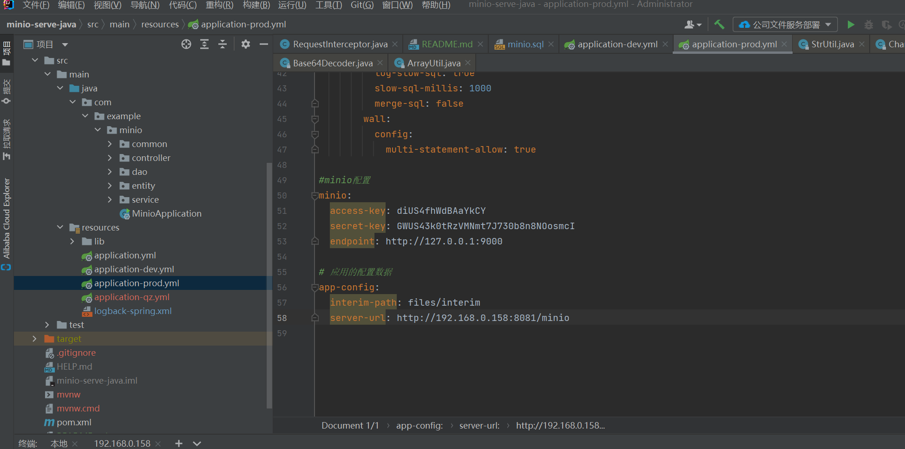
> access-key：刚才配置的登录账号
> 
> secret-key：刚才配置的登录密码
> 
> endpoint：minio运行的地址
> 
> interim-path：临时文件地址，用于临时文件的存储比如word预览时要转成pdf，此时pdf文件就是临时文件，后面会讲述临时文件的清理。[api使用说明](#### 6. 清除临时文件)
> 
> server-url：服务运行的地址，用于生成文件分享时的文件地址，或其他用途。

## api使用

目前只提供了java的start使用jar，github地址：https://github.com/2434017367/minio-java-start

---

### maven引用

### 初始化配置

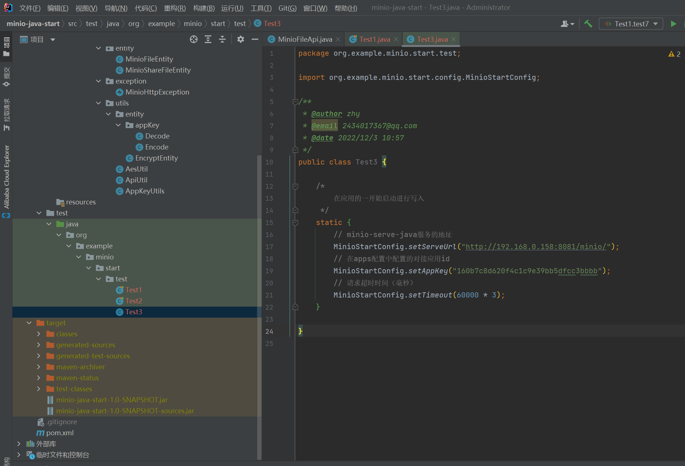

### 使用

#### 1. 文件上传

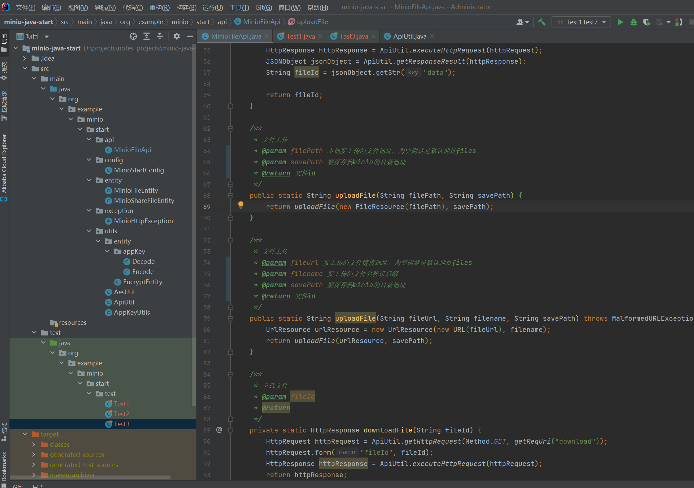

```java
 /**
 * 文件上传
 */
@Test
public void fileUploadTest() {
    // 本地地址上传
    MinioFileApi.uploadFile("D:\\projects\\notes_projects\\minio-serve-java\\readme_images\\3_2.png", null);
    // 链接上传
    try {
        MinioFileApi.uploadFile("https://www.runoob.com/docker/docker-run-command.html", "测试.html", null);
    } catch (MalformedURLException e) {
        e.printStackTrace();
    }
}
```

#### 2. 文件下载

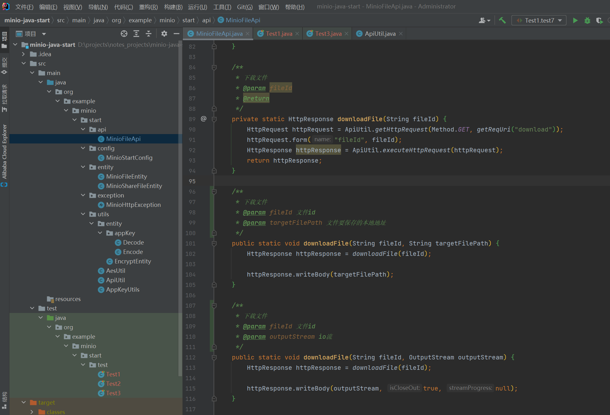

#### 3. word转pdf

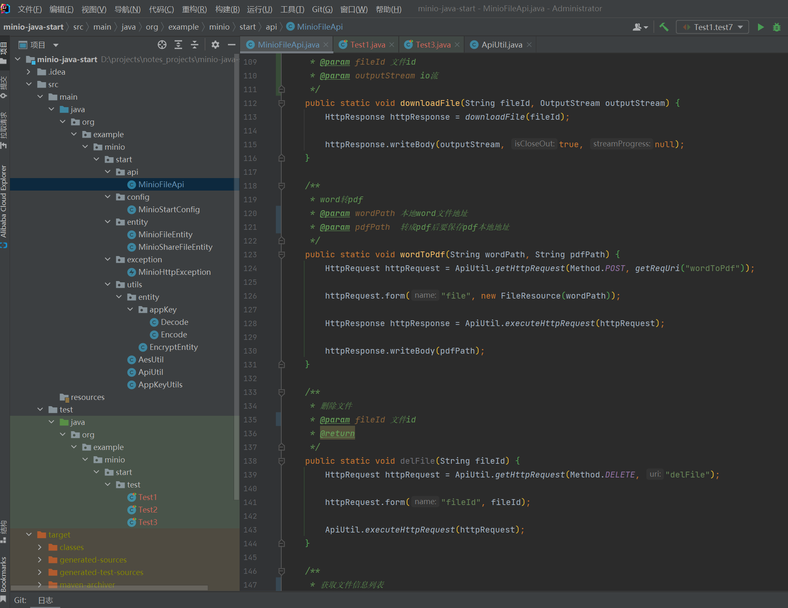

#### 4. 删除文件

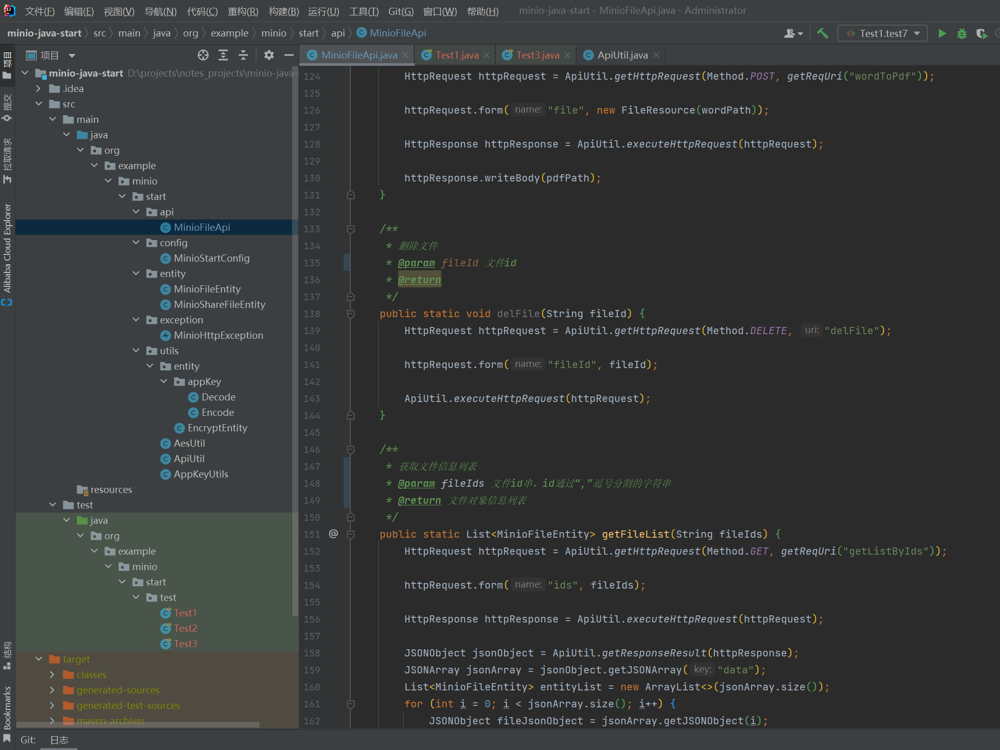

#### 5. 获取文件信息列表

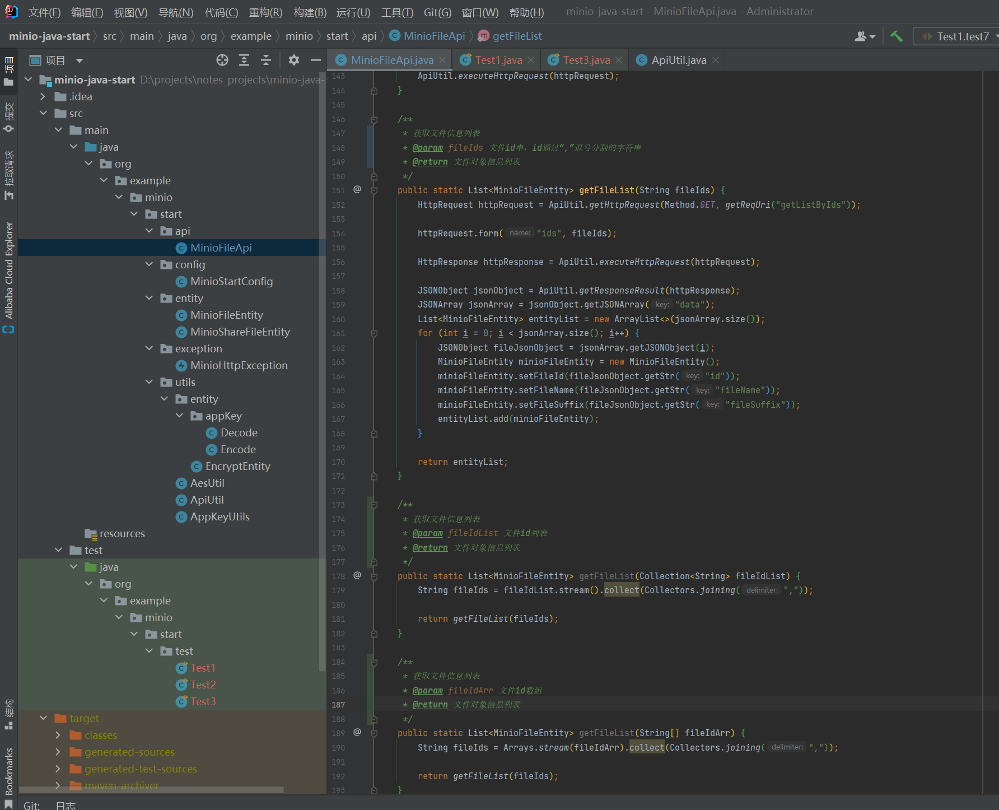

#### 6. 清除临时文件
对临时文件目录下的文件进行删除

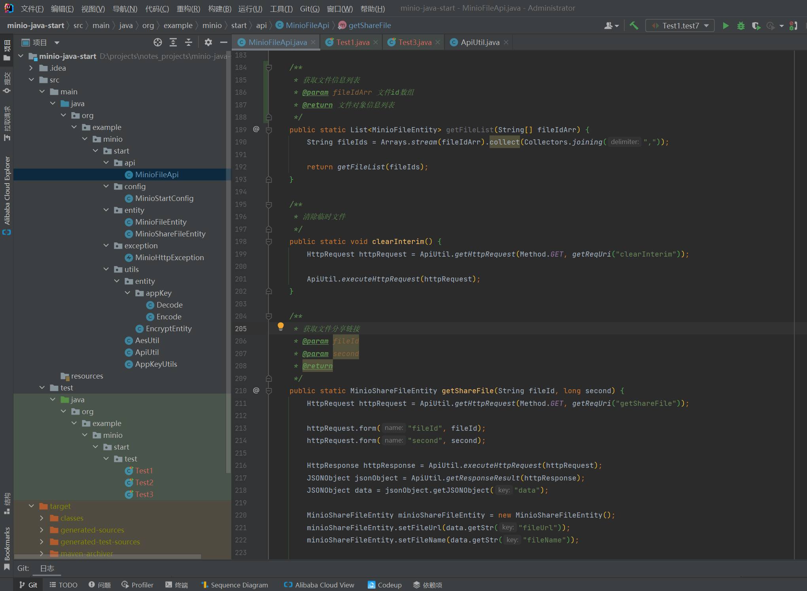

#### 7. 获取文件分享链接
分享获取到的文件链接则会跳过校验，在链接后面加上isPreview=true参数则为文件预览。

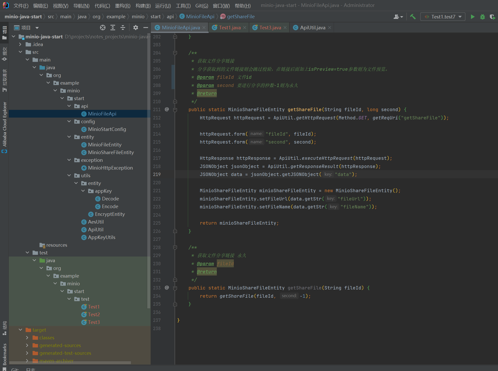


## 结语
文档上描述的不够细致的地方，还烦请大家查阅相关文档与代码。

开源不易，不喜勿喷。


